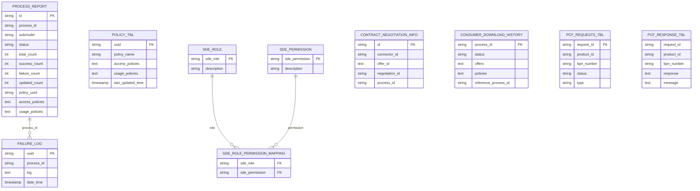

# Data Model and Flyway

## Persistence Model

The backend uses PostgreSQL with Flyway migrations and JPA/EclipseLink. The data
model has grown historically and combines:

- explicit Flyway tables
- JPA entities
- table and column access derived dynamically from submodel schemas
- serialized JSON/text fields for policies, offers, and details
- business relationships through string IDs instead of JPA relations

Source: [persistence-overview.mmd](../media/diagram/architecture/persistence-overview.mmd)

## Flyway Migrations

Migrations are located in `modules/sde-core/src/main/resources/flyway`.

| Area | Migrations | Purpose |
| --- | --- | --- |
| Legacy auth | `V2`, `V7` | Create and later drop an old `auth` table |
| Base data | `V3`, `V4` | `aspect`, `aspect_relationship`, `failure_log`, `process_report` |
| Process report | `V5`, `V8`, `V12`, `V24`, `V27` | Access/usage policy, policy UUID, update/delete, reference process |
| Batch/submodels | `V6`, `V11`-`V18`, `V30`, `V33` | Submodel-specific tables and technical IDs |
| Contract info | `V9`, `V10`, `V20` | Create and reshape `contract_negotiation_info` |
| Roles/permissions | `V13`, `V19`, `V21`-`V26` | Roles, permissions, and mappings |
| PCF | `V25`, `V28`, `V29`, `V31`, `V32` | PCF permissions, requests, responses, and unique constraint |

## Important Entities

### `ProcessReportEntity`

Mapped to `process_report`. It is the central process history for upload,
delete, and processing. It stores status, counts, policy UUID, and access/usage
policies.

### `FailureLogEntity`

Mapped to `failure_log`. It stores errors by process, usually from row
processing.

### `PolicyEntity`

Mapped to `policy_tbl`. It stores local policies with name, access policies, and
usage policies.

Important uncertainty: no create migration for `policy_tbl` was found in the
visible Flyway files.

### `ConsumerDownloadHistoryEntity`

Mapped to `consumer_download_history`. It stores download status, offers,
policies, and references. No create migration was found in the visible
migrations.

### Role Model

- `RoleEntity` -> `sde_role`
- `RolePermissionEntity` -> `sde_role_permission_mapping`
- `PermissionEntity` is suspiciously mapped to `sde_role`, while Flyway creates
  `sde_permission`. This looks like a bug or unused legacy code.

### PCF Entities

- `PcfRequestEntity` -> `pcf_requests_tbl`
- `PcfResponseEntity` -> `pcf_response_tbl`

The visible Flyway migrations change these tables but do not clearly create
them. It must be clarified whether creation happens through Hibernate
`ddl-auto`, migrations outside the visible path, or another mechanism.

## Submodel History Tables

Submodel data is stored in tables whose names and columns are derived from
submodel schemas. Examples visible in Flyway and the module structure:

- `aspect`
- `aspect_relationship`
- `batch`
- `batch_v_300`
- `part_as_planned`
- `part_site_information_as_planned`
- `parttypeinformation_v_100`
- `pcf_aspect`
- `serialpart_v_300`
- `single_level_bom_as_planned`
- `single_level_bom_as_planned_v_300`
- `single_level_bom_asbuilt_v_300`
- `single_level_usage_as_built`
- `single_level_usage_as_built_v_300`

Technical columns added by the pipeline:

- `process_id`
- `deleted`
- `updated`
- `shell_id`
- `submodule_id`
- `asset_id`
- `access_policy_id`
- `usage_policy_id`
- `contract_defination_id`
- `shell_access_rule_ids`

## Data-Model Risks

- `spring.jpa.hibernate.ddl-auto=create` in the main `application.properties`
  can hide Flyway gaps or cause data loss.
- Not all JPA entities are visibly covered by Flyway.
- Table and column names are partly handled dynamically. This is safe only when
  submodel schema metadata is strictly controlled.
- Business relationships use string IDs instead of constraints, so consistency
  depends more heavily on application code.

