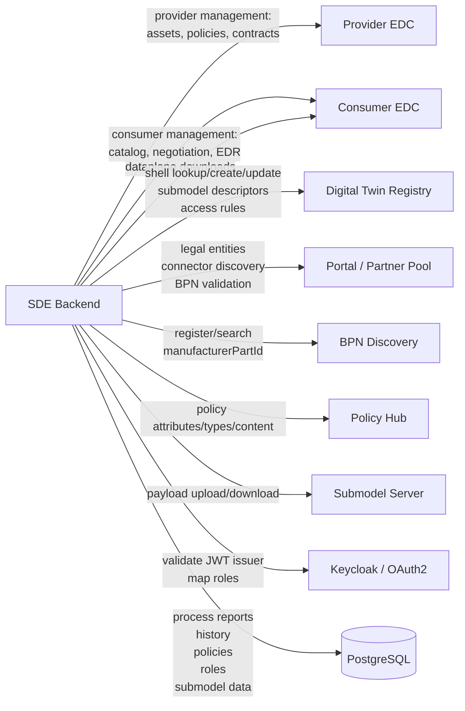

# External Systems

The backend is heavily integration-driven. This chapter summarizes the external
systems, related modules, and business purposes.

Source: [external-systems.mmd](../media/diagram/architecture/external-systems.mmd)

## EDC

Module: `modules/sde-external-services/edc`

Provider-side capabilities:

- asset lookup
- asset create/update/delete
- access policy and usage policy create/update/delete
- contract definition create/update/delete
- business partner group handling
- registration of the Digital Twin Registry as its own EDC asset

Consumer-side capabilities:

- catalog query
- contract negotiation
- contract agreement listing
- EDR token and endpoint handling
- dataplane download

Important configuration groups:

- `edc.hostname`
- `edc.managementpath`
- `edc.apiKeyHeader`
- `edc.apiKey`
- `edc.consumer.hostname`
- `edc.consumer.apikeyheader`
- `edc.consumer.apikey`
- `edc.consumer.protocol.path`
- `edc.consumer.managementpath`
- `edr.*`

## Digital Twin Registry

Module: `modules/sde-external-services/digital-twins`

Capabilities:

- shell lookup by specific asset IDs
- shell creation if no shell exists and the submodel allows creation
- shell update with submodel descriptor
- submodel descriptor lookup/update
- access rule management
- dDTR lookup for consumer flows

The submodel descriptor contains endpoints that point to EDC dataplane/submodel
resources. Depending on configuration, the backend uses `edc.dataplane.hostname`,
`edc.dataplane.endpointpath`, DSP paths, and asset IDs in the subprotocol body.

## Portal / Partner Pool

Module: `modules/sde-external-services/portal`

Capabilities:

- legal entity search
- connector discovery
- unified BPN validation
- Partner Pool queries

The Portal is mainly used in consumer flows to derive connector information from
BPN or related search criteria.

## BPN Discovery

Module: `modules/sde-external-services/bpn-discovery`

Capabilities:

- BPN search by `manufacturerPartId`
- registration of lookup data after provider upload

Static analysis did not show complete cleanup of BPN Discovery entries in the
delete flow.

## Policy Hub

Module: `modules/sde-external-services/policy-hub`

Capabilities:

- read policy attributes
- read policy types
- read or create policy content

The backend exposes proxy endpoints under `/api/policy-hub`.

## Submodel Server

Module: `modules/sde-external-services/submodel-server`

Capabilities:

- upload submodel payloads
- download submodel payloads
- provide EDC with a data source for submodel data

The executor calls uploads directly in the provider pipeline. Whether the
Submodel Server is optional or required depends on the `submodel.datasource.*`
properties and the deployment model.

## Keycloak / OAuth2 Issuer

The backend is an OAuth2 resource server. JWTs are validated against the
configured issuer URI. Roles are read from Keycloak claims and then interpreted
through database permissions.

## PostgreSQL

PostgreSQL stores:

- process reports
- failure logs
- submodel history tables
- contract negotiation information
- roles and permissions
- policies
- consumer download history
- PCF requests and responses

Schema management is mixed: Flyway covers many tables, but not every JPA entity
is clearly created by the visible migrations.

