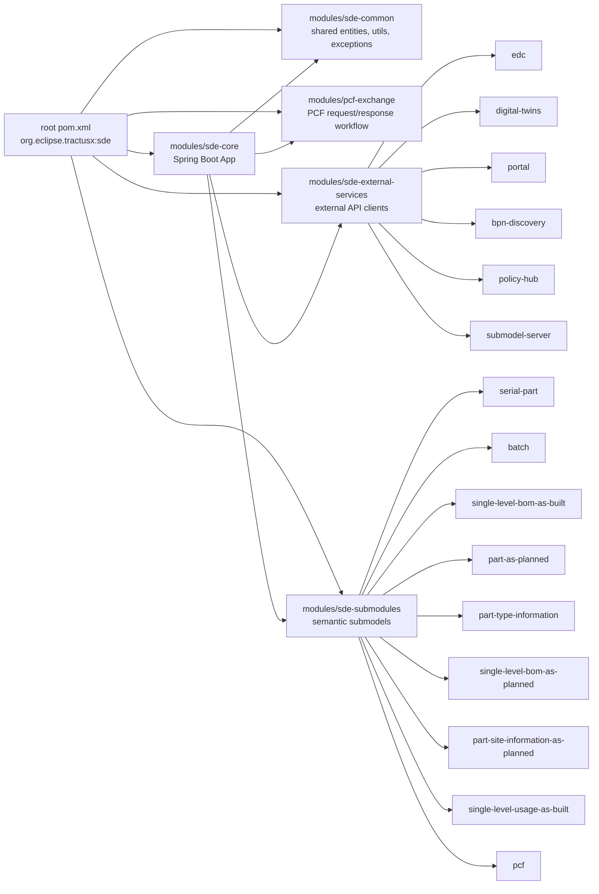

# Module Map

## Maven Structure

The root project is a Maven aggregator using the Spring Boot parent. The
application runs from `modules/sde-core` and depends on the local modules.

Source: [module-dependencies.mmd](../media/diagram/architecture/module-dependencies.mmd)

## `modules/sde-core`

Responsibilities:

- starts the Spring Boot application
- exposes REST controllers
- contains security configuration
- orchestrates submodel processing
- manages process reports, policies, roles, and downloads
- runs Flyway migrations and JPA access
- contains `application.properties`, OpenAPI, and `use-case.json`

Important packages:

- `configuration`: security, OpenAPI, and JPA configuration
- `core/controller`: REST API
- `core/service`: orchestration and business services
- `core/submodel/executor`: generic submodel execution
- `core/submodel/executor/step`: DTR, EDC, database, and response steps
- `core/processreport`: process and download history
- `core/policy`: local policy management
- `core/role`: role and permission management
- `core/failurelog`: per-process error logging
- `core/csv`: CSV file handling and CSV-to-JSON conversion

## `modules/sde-common`

Responsibilities:

- shared entities and models
- JSON and CSV mapping helpers
- exceptions and global error handling
- submodel executor interfaces
- configuration property holders for EDC, DTR, SDE, and PCF
- constants for submodule and EDC/DTR mapping

This module is used by core, external services, and submodules.

## `modules/sde-external-services`

These modules wrap Feign clients, request/response models, and facilitators for
external systems.

| Module | Purpose |
| --- | --- |
| `edc` | Provider and consumer EDC APIs, assets, policies, contracts, catalog, negotiation, EDR |
| `digital-twins` | Shell lookup/create/update, submodel descriptors, access rules |
| `portal` | Legal entities, Partner Pool, connector discovery, unified BPN validation |
| `bpn-discovery` | BPN and manufacturer-part-ID lookup and registration |
| `policy-hub` | Policy attributes, types, and content |
| `submodel-server` | Upload and download of submodel payloads |

## `modules/sde-submodules`

Submodules define how business submodel data is validated, stored in tables,
mapped to DTR/EDC, and returned. Many table and column names are derived from
submodel schemas.

Dynamic table and column operations must only use trusted schema metadata. This
matters for both security and data-model maintenance.

## `modules/pcf-exchange`

Responsibilities:

- persist PCF requests and responses
- implement the PCF consumer/provider workflow
- expose the EDC-facing proxy for `GET|PUT /api/pcf/productIds/{productId}`
- push PCF data or rejection messages

PCF partially uses the normal submodel pipeline, but it has special EDC
semantics with a static PCF Exchange asset.

