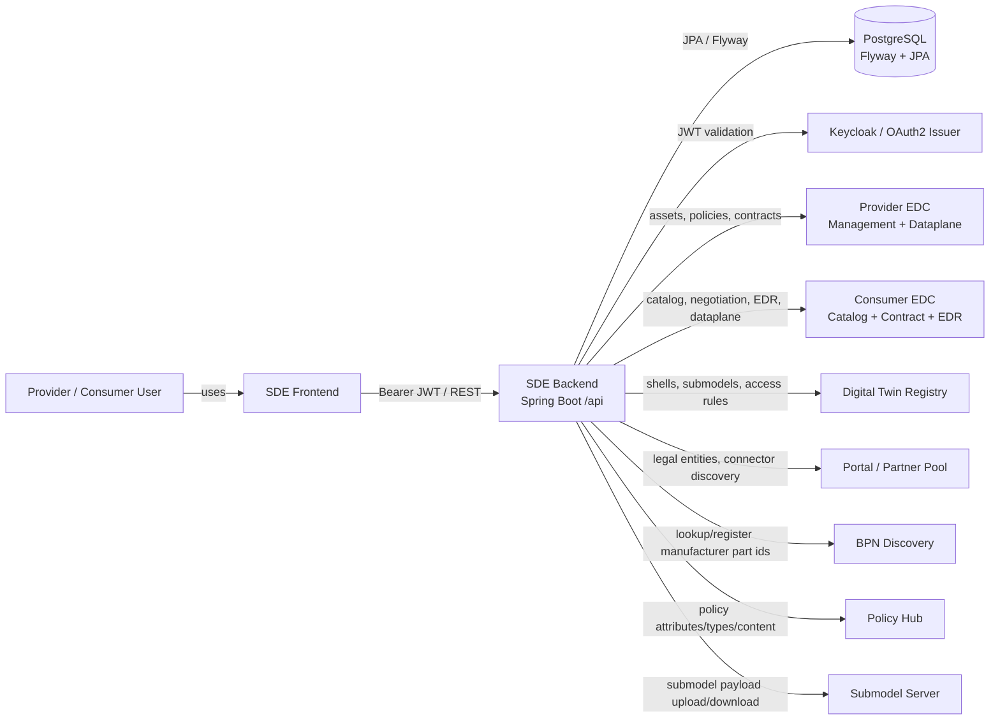

# Architecture Overview

## Backend Purpose

The backend is the server-side core of the Managed Simple Data Exchanger. It
allows companies to provide and consume submodel data in the Tractus-X/Catena-X
context. Functionally, it connects three layers:

- **Data intake:** CSV upload or manual JSON input by providers.
- **Data publication:** Digital Twin Registry, EDC assets, policies, contract
  definitions, and optionally a Submodel Server.
- **Data consumption:** Data-offer search, contract negotiation, EDR/dataplane
  access, and download history.

This system is not just a CRUD backend. It orchestrates several external
Tractus-X components.

## System Context

Source: [context.mmd](../media/diagram/architecture/context.mmd)

## Layers

### API Layer

Controllers live in `modules/sde-core/src/main/java/.../core/controller` and
expose REST endpoints below the `/api` context path.

Important controllers:

- `SubmodelController`
- `SubmodelProcessController`
- `SubmodelCsvController`
- `ConsumerController`
- `PcfExchangeController`
- `PolicyController`
- `PolicyHubController`
- `PortalProxyController`
- `ContractManagementController`
- `ProcessReportController`
- `RoleManagementController`
- `PingController`

### Orchestration Layer

`modules/sde-core` coordinates submodel processing, process reports, policies,
consumer downloads, roles, and external service clients.

Key classes:

- `SubmodelOrchestartorService`
- `GenericSubmodelExecutor`
- `DigitalTwinUseCaseHandler`
- `EDCUsecaseHandler`
- `DatabaseUsecaseHandler`
- `SubmodelServerHandler`
- `ProcessReportUseCase`
- `ConsumerService`

### Integration Layer

External APIs are wrapped in dedicated Maven modules:

- `modules/sde-external-services/edc`
- `modules/sde-external-services/digital-twins`
- `modules/sde-external-services/portal`
- `modules/sde-external-services/bpn-discovery`
- `modules/sde-external-services/policy-hub`
- `modules/sde-external-services/submodel-server`

### Domain Submodules

Semantic submodels live in `modules/sde-submodules`. Each submodule provides
schema, mapping, validation, and sometimes custom executor logic.

Supported submodules visible in the project:

- `serial-part`
- `batch`
- `single-level-bom-as-built`
- `part-as-planned`
- `part-type-information`
- `single-level-bom-as-planned`
- `part-site-information-as-planned`
- `single-level-usage-as-built`
- `pcf`

### Persistence

Persistence uses PostgreSQL, Flyway, and JPA/EclipseLink. Many business
relationships are represented through string identifiers such as `process_id`,
`policy_uuid`, `request_id`, `connector_id`, or EDC asset and policy IDs.
Explicit JPA relationships are the exception.

## Cross-Cutting Concerns

- **Security:** OAuth2 resource server with JWT roles from Keycloak and
  database-backed permission evaluation.
- **Policies:** local policy management plus Policy Hub proxying.
- **Process reports:** upload, delete, and download processes are traceable by
  process IDs.
- **OpenAPI:** static contract at
  `modules/sde-core/src/main/resources/sde-open-api.yml`; known drift from code
  is documented.
- **Runtime:** port 8080, context path `/api`, Dockerfile exposes 8080.

