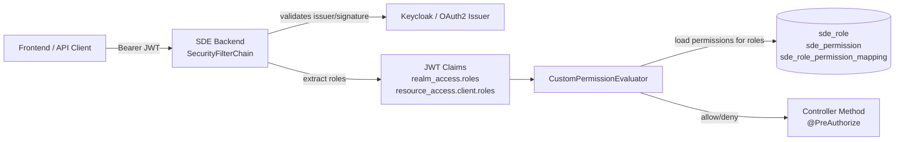

# Security

## Security Model

The backend is configured as an OAuth2 resource server. Every non-public route
requires a valid bearer JWT. Business permissions are additionally checked with
`@PreAuthorize("hasPermission(...)")` and database-backed permission evaluation.

Source: [security-overview.mmd](../media/diagram/architecture/security-overview.mmd)

## JWT Role Mapping

`SecurityConfig` reads roles from:

- `realm_access.roles`
- `resource_access.{keycloak.clientid}.roles`

Roles are converted to `SimpleGrantedAuthority` without a `ROLE_` prefix.
Therefore:

- Keycloak roles must match database roles exactly.
- Role names are case-sensitive.
- Typical roles from Flyway are `Admin`, `User`, and `Creator`.

## Permission Evaluation

`CustomPermissionEvaluator` compares JWT authorities with role/permission
mappings stored in PostgreSQL.

Examples:

- `hasPermission('', 'consumer_view_contract_offers')`
- `hasPermission(#submodel, 'provider_create_contract_offer@provider_update_contract_offer')`
- `hasPermission(#role, 'create_role')`

Permission expressions with `@` are interpreted as OR lists. A user may execute
the method when at least one permission is found for one of the user's roles.

## Public URLs

According to `SecurityConfig`, these paths are public:

- `/ping`
- `/cache/**`
- `/api-docs/**`
- `/swagger-ui/**`
- `*/swagger-ui/**`
- `/actuator/health/readiness`
- `/actuator/health/liveness`
- `/v3/api-docs/**`

All other routes require authentication.

## Headers and Browser Security

Configured behavior:

- stateless session management
- CSRF disabled
- CORS enabled with `*` for origins, methods, headers, and exposed headers
- XSS protection header
- Content Security Policy
- HSTS with subdomains

Assessment:

- Disabled CSRF is understandable for stateless bearer-token APIs.
- Fully open CORS is critical for production and should either be restricted or
  documented as an intentional operating decision.
- Public Swagger/API docs and public cache endpoints must be explicitly
  evaluated.

## Security-Relevant Properties

Static analysis found several sensitive or production-like values in
`modules/sde-core/src/main/resources/application.properties`:

- Keycloak issuer and client ID
- PostgreSQL URL, user, and password
- EDC API keys
- client secrets for Digital Twins, Portal, Policy Hub, and other services
- staging or production-like hostnames
- `management.endpoints.web.exposure.include=*`
- `management.endpoint.health.show-details=always`
- debug logging for root, HTTP, and Feign

Expected operating behavior:

- Secrets belong in secret stores, Kubernetes Secrets, Vault, or external
  deployment-specific configuration.
- `application.properties` should not contain real or reusable secrets.
- Debug logging and health details should be restricted in production.

## Role and Permission Risks

Flyway indicates that `User` may receive role-management permissions such as
`create_role`, `read_role_permission`, and later `delete_role`.

Open questions:

- Is `User` really intended to be an administrative role?
- Should role management be restricted to `Admin`?
- Are there Keycloak role conventions that mitigate this?

## API-Specific Security Notes

- `/cache/**` is public and mutates state through GET.
- `GET /api/{submodel}/public/{uuid}` has no method-level annotation and should
  still require authentication through the global rule; the path name suggests
  public access and should be clarified.
- `GET|PUT /api/pcf/productIds/{productId}` have no method-level annotation but
  require authentication through the global rule and expect the `Edc-Bpn`
  header.
- File uploads need size limits, content validation, and safe storage.
- Data received from EDC, DTR, Portal, and BPN Discovery should be treated as
  untrusted input.

## Test Gaps

Some visible controller tests disable MockMvc filters. Therefore, they do not
fully test the real security chain.

Recommended tests:

- JWT role extraction from realm and resource claims
- positive and negative `PermissionEvaluator` cases
- public-versus-authenticated routing
- CORS behavior in production-like configuration
- role-management rights for `User`, `Admin`, and `Creator`
- negative tests for upload, PCF, and consumer download

